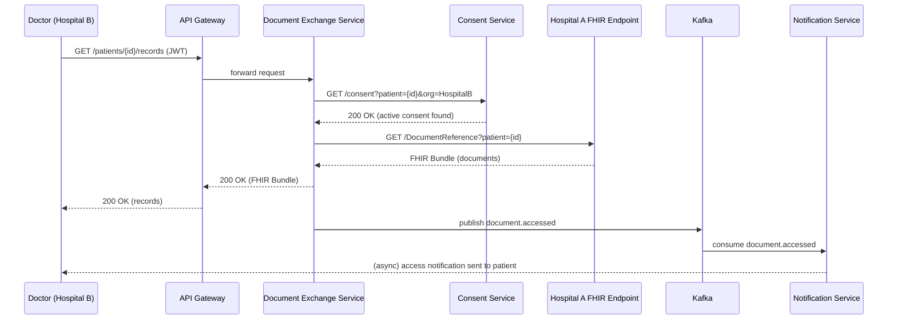
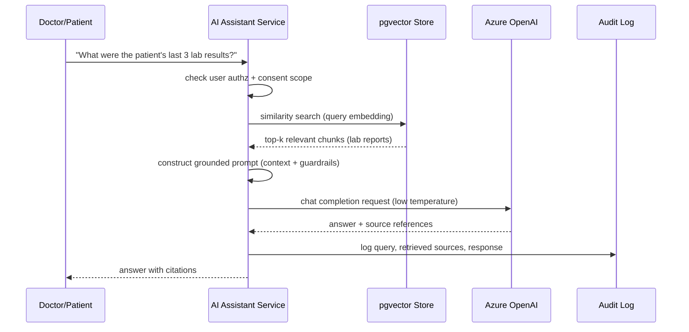

## How to use this guide

This guide prepares you to discuss a healthcare interoperability platform as a **Senior Java Backend Developer** — a contributor who built services, APIs, and integrations, not the infrastructure owner or system architect. Throughout, whenever infrastructure or platform-level decisions come up, the correct framing is: *"The DevOps/Cloud team owned that decision — I understood it, configured my service to work with it, and consumed it correctly."* Never claim to have designed the Kubernetes cluster, chosen the AWS account structure, or set up CI/CD pipelines from scratch — you *used* these, you didn't *build* them.

**One honesty note before you dive in:** Part 5 contains example "production stories" in STAR format. These are templates showing you *how* such a story should be structured and *how deep* the technical detail should go — they are not verified facts about your work history. Use them to practice the format and the level of detail interviewers expect. If you present one as your own lived experience, be able to answer follow-up questions about it as if you actually lived it — which only works if something similar genuinely happened to you. Where nothing similar happened, it's safer to speak in honest, general terms about your real contributions than to commit to invented specifics you can't defend under cross-questioning.

---

# Part 1 — Healthcare Interoperability Platform: Project Overview

## 1.1 Elevator Pitch (60 seconds)

"I worked as a backend developer on a healthcare interoperability platform that connected multiple hospitals so patient data — records, prescriptions, consent, and clinical documents — could be shared securely between them. The system was built as Java Spring Boot microservices: separate services for patient management, doctor/appointment management, consent management, and document exchange, all communicating over REST for synchronous calls and Kafka for asynchronous events like notifications and record updates. Data exchange between hospitals followed the FHIR standard, so records were structured in a way any FHIR-compliant system could understand. I also worked on an AI assistant layer that used Retrieval-Augmented Generation with Azure OpenAI to let doctors and patients ask natural-language questions and get answers grounded in real patient data, with safeguards to prevent the model from making things up. The platform ran on Kubernetes on AWS, managed by our DevOps team, and I focused on the application layer — building APIs, fixing production issues, and improving performance."

## 1.2 Detailed Explanation (5–10 minutes)

**Problem being solved:** Hospitals traditionally keep patient data in isolated systems. A patient visiting Hospital B has no easy way to let Hospital B see relevant history from Hospital A — labs, prescriptions, past encounters. Manual faxing/emailing of records is slow, insecure, and error-prone. The platform's job was to let a patient explicitly **consent** to specific data being shared with a specific hospital/provider for a specific purpose, and then let that data move between systems in a standardized, auditable, secure way.

**High-level architecture, service by service:**

- **Patient Service** — owns patient demographics, registration, patient search, and profile updates. Exposes REST APIs, backed by PostgreSQL.
- **Doctor/Provider Service** — doctor profiles, specialties, hospital affiliation, availability slots for appointments.
- **Appointment Service** — booking, rescheduling, cancellation; publishes Kafka events consumed by notification service.
- **Consent Service** — the core of the interoperability story. Stores FHIR `Consent` resources: who the patient is, which organization/provider is being granted access, what data categories, what time window, and whether it's still active or revoked.
- **Document Exchange Service** — implements FHIR `DocumentReference` handling: given a valid, active consent, fetches or forwards clinical documents (discharge summaries, prescriptions, lab reports) between hospital systems.
- **Notification Service** — Kafka consumer that turns domain events (appointment booked, consent granted, document shared) into emails/SMS/push notifications.
- **AI Assistant Service** — the RAG-based Q&A layer described in Part 4.
- **API Gateway** — single entry point, handles routing, and works with an identity provider for authentication (owned largely by a platform team, but every service integrates with it via Spring Security).

**Why microservices here specifically:** Each domain (patient, consent, documents, appointments) has a different data-sensitivity profile and a different change cadence. Consent logic, for instance, has strict HIPAA-driven audit requirements and changes independently of, say, the appointment booking UI flow. Splitting them lets each team/service scale, deploy, and secure independently, and it isolates a failure in one domain (e.g., notification delays) from a critical domain (e.g., consent enforcement).

## 1.3 Microservice Communication

- **Synchronous (REST, over HTTPS, internal to the cluster via Kubernetes service discovery):** used when a caller needs an immediate answer — e.g., Document Exchange Service calling Consent Service synchronously to check "is there an active consent for this patient-to-hospital data share?" before releasing a document.
- **Asynchronous (Kafka):** used when the caller doesn't need to wait — e.g., Appointment Service publishes `appointment.booked`, and Notification Service picks it up whenever it can, decoupling booking latency from notification delivery.
- **Resilience patterns discussed at the code level (owned by app team, not infra):** timeouts and retries via Spring's `RestTemplate`/`WebClient` configuration, circuit breaking with Resilience4j to stop hammering a struggling downstream service, and fallback responses where reasonable (e.g., show cached doctor availability if the live call times out).

## 1.4 Database Flow

- Each core service owns its own PostgreSQL schema (database-per-service pattern) — Patient Service doesn't reach into Consent Service's tables directly; it calls the Consent API.
- **Redis** sits in front of read-heavy, slow-changing data — doctor availability slots, hospital directory lookups — to cut round trips to Postgres on high-traffic read paths.
- **pgvector** extension on Postgres stores embeddings for the RAG pipeline (Part 4) — reusing the existing Postgres infrastructure instead of standing up a separate vector database.
- Write paths go through the owning service only; anything another service needs is either requested via API or received via a Kafka event that the consumer projects into its own local read model (a light event-driven "read replica" pattern, not full CQRS).

## 1.5 Authentication & Authorization Flow

1. User (doctor, patient, or admin) authenticates against the identity provider (OAuth2/OIDC) and receives a signed JWT access token.
2. Every request into the API Gateway carries this token; the Gateway validates the signature/expiry and forwards it downstream.
3. Each Spring Boot service uses **Spring Security's resource-server support** to validate the JWT locally (checking issuer, audience, expiry, signature against the identity provider's public keys) — no service trusts a request without a valid token.
4. **Role-based authorization** (`ROLE_DOCTOR`, `ROLE_PATIENT`, `ROLE_ADMIN`) controls which endpoints a caller can hit.
5. **Consent-based authorization** is layered on top for clinical data: even a doctor with valid `ROLE_DOCTOR` access can't pull a specific patient's records unless there's an active `Consent` resource permitting it — this check happens in the Document Exchange Service before any data leaves the boundary.
6. Every access to sensitive data — granted or denied — is written to an **audit log** (who, what resource, when, under which consent ID), which matters for HIPAA-style compliance reviews.

## 1.6 API Flow (example: doctor requests a patient's shared records)

1. Doctor's client calls `GET /api/v1/patients/{id}/records` with a JWT bearer token.
2. Gateway validates the token, routes to Document Exchange Service.
3. Service calls Consent Service synchronously: "is there an active consent covering this patient, this requesting hospital, and this data category?"
4. If yes, service resolves the actual `DocumentReference` entries (possibly a synchronous call to the source hospital's exposed FHIR endpoint, or a local cache if previously fetched).
5. Response is assembled as a FHIR `Bundle`, returned to the doctor's client.
6. An audit event and a Kafka event (`document.accessed`) are emitted asynchronously — the response to the doctor doesn't wait on these.

## 1.7 Kafka Flow (high level — detail in Part 3)

Domain services publish events for state changes that other services care about (`patient.created`, `consent.granted`, `consent.revoked`, `appointment.booked`, `document.shared`). Consumers (mainly Notification Service, and an audit/event-sourcing sink) subscribe to relevant topics. This keeps services loosely coupled — Patient Service doesn't need to know Notification Service exists; it just publishes an event.

## 1.8 Deployment Flow

- Code is built and containerized (Docker image per service), pushed to **ECR**.
- CI/CD pipeline (owned by DevOps/platform team) deploys the image to **EKS**.
- As a backend developer, my involvement was: writing the Dockerfile for my service, making sure health-check endpoints (`/actuator/health`) were correctly exposed for Kubernetes liveness/readiness probes, externalizing configuration via environment variables/config maps instead of hardcoding, and validating my service behaved correctly post-deploy — not designing the cluster, node groups, or pipeline infrastructure itself.

## 1.9 Sequence Diagram — Cross-Hospital Document Fetch (Consent-Gated)



## 1.10 Sequence Diagram — AI Assistant Query (RAG)



## 1.11 End-to-End Request Lifecycle (summary)

Request enters at the Gateway → JWT validated → routed to owning microservice → service validates authorization (role + consent where applicable) → service performs its core logic (DB read/write, calls to peer services, or FHIR calls) → response returned synchronously → any side effects (notifications, audit, analytics) emitted asynchronously via Kafka so they never add latency to the caller → downstream consumers process independently, with retry/DLQ safety nets (Part 3).

---

# Part 2 — FHIR (Fast Healthcare Interoperability Resources)

## 2.1 Why FHIR

FHIR is the HL7 standard for exchanging healthcare data using REST APIs and JSON/XML resources with a well-defined schema. Before FHIR, healthcare interoperability leaned on HL7 v2 (pipe-delimited messages, painful to parse and validate) or proprietary formats unique to each vendor. FHIR gives you:

- A REST-native API model (`GET /Patient/{id}`, `POST /Consent`) instead of message queues full of custom formats.
- Well-defined **resources** (Patient, Consent, Observation, etc.) with standard fields, so two hospitals on completely different core systems can still exchange data if both expose FHIR-compliant endpoints.
- Extensibility — resources can carry custom extensions for local needs while still validating against the base spec.
- Built-in support for the exact problem this platform solves: **cross-organization data sharing gated by consent**.

## 2.2 Key Resources Used

**Patient** — demographics, identifiers (MRN), contact info. Every clinical resource references a Patient by ID.

```json
{
  "resourceType": "Patient",
  "id": "12345",
  "identifier": [{ "system": "urn:hospital-a:mrn", "value": "MRN-98213" }],
  "name": [{ "family": "Sharma", "given": ["Rohit"] }],
  "gender": "male",
  "birthDate": "1990-04-12"
}
```

**Consent** — the access-control backbone. Encodes who is granting access, to whom, over what data categories, for how long.

```json
{
  "resourceType": "Consent",
  "status": "active",
  "patient": { "reference": "Patient/12345" },
  "provision": {
    "period": { "start": "2026-06-01", "end": "2026-12-01" },
    "actor": [{ "reference": { "reference": "Organization/hospital-b" } }],
    "purpose": [{ "code": "TREAT" }]
  }
}
```

**DocumentReference** — pointer to a clinical document (discharge summary, prescription PDF, lab report) with metadata: type, author, date, and where to fetch the actual content.

**MedicationRequest** — a prescription: drug, dosage, prescriber, status (active/completed/stopped). Used when Hospital B needs to see what a patient is currently prescribed to avoid dangerous interactions.

**Observation** — a single clinical measurement or result: a lab value, a vital sign, with `code` (what was measured), `value`, and `effectiveDateTime`.

**Encounter** — a visit/interaction: admission, outpatient visit, ER visit — the container that ties together what happened during a specific episode of care.

## 2.3 Realistic APIs

- `GET /fhir/Patient/{id}` — fetch patient demographics.
- `POST /fhir/Consent` — patient (or their portal) grants consent to a specific hospital/provider.
- `GET /fhir/Consent?patient={id}&status=active` — check active consents before releasing data.
- `GET /fhir/DocumentReference?patient={id}&type=discharge-summary` — list available documents of a type.
- `GET /fhir/Binary/{id}` — fetch the actual document bytes referenced by a DocumentReference.
- `GET /fhir/MedicationRequest?patient={id}&status=active` — current medications for interaction checks.
- `GET /fhir/Observation?patient={id}&category=laboratory&_sort=-date` — most recent lab results.

## 2.4 Document Sharing Between Hospitals — the Full Flow

1. Patient logs into a patient portal and reviews a request from Hospital B (or proactively grants access) — this creates a `Consent` resource with `status: active`, scoped to specific data categories and a validity window.
2. Hospital B's clinician searches for the patient in the platform. The platform checks: does an active `Consent` exist naming Hospital B as an authorized actor?
3. If yes, Document Exchange Service queries Hospital A's exposed FHIR `DocumentReference` endpoint for that patient.
4. Returned references are validated (correct patient ID match, non-expired, correct resource type) and the actual content is fetched via the `Binary` endpoint if needed.
5. Data is returned to Hospital B's clinician as a FHIR `Bundle`, and the transaction is logged.
6. If the patient revokes consent (`Consent.status = revoked`) at any point, all future access attempts are denied immediately — enforcement is checked per request, not cached long-term.

## 2.5 Validation, AuthN/AuthZ, Audit, Error Handling

- **Validation:** every inbound FHIR resource is validated against its structure definition (required fields, correct reference types, valid coding systems like LOINC for lab codes or RxNorm for medications) before being persisted or forwarded — malformed resources are rejected with a FHIR `OperationOutcome` describing exactly what's wrong.
- **AuthN:** JWT-based, as described in Part 1.5.
- **AuthZ:** role-based (can this caller even hit this endpoint) layered with consent-based (is there a specific active grant for this specific patient/data).
- **Audit logging:** every read/write of clinical data logs actor, resource type, resource ID, consent ID used, timestamp, and outcome — required for HIPAA-style accountability and useful for debugging disputed access claims.
- **Error handling:** standard FHIR error responses using `OperationOutcome` resources with meaningful `issue` codes (`not-found`, `forbidden`, `invalid`) instead of generic 500s, so client systems can react appropriately (e.g., distinguish "no consent" from "patient doesn't exist").

---

# Part 3 — Kafka

## 3.1 Producers & Consumers in This System

Domain services (Patient, Consent, Appointment, Document Exchange) act as **producers** — they publish events describing something that already happened in their domain. Notification Service, an audit/event-sink service, and occasionally the AI Assistant Service (to refresh embeddings when a new document arrives) act as **consumers**.

## 3.2 Topics (realistic examples)

| Topic | Producer | Consumer(s) | Purpose |
|---|---|---|---|
| `patient.created` | Patient Service | Notification, Audit | welcome flow, downstream projections |
| `consent.granted` / `consent.revoked` | Consent Service | Notification, Document Exchange (cache invalidation), Audit | keep dependent services in sync |
| `appointment.booked` / `appointment.cancelled` | Appointment Service | Notification | reminders, cancellations |
| `document.shared` | Document Exchange | Notification, Audit | patient-facing transparency, compliance trail |
| `document.ingested` | Document Exchange | AI Assistant Service | trigger chunk + embed pipeline for new clinical docs |

## 3.3 Event Flow Example

Consent Service updates a consent's status to `revoked` in Postgres → publishes `consent.revoked` with `{consentId, patientId, orgId, revokedAt}` → Document Exchange Service consumes it and evicts any cached access flags for that patient/org pair → Notification Service consumes the same event and informs the patient their consent change took effect.

## 3.4 Retry & Dead Letter Queue

If a consumer fails to process a message (e.g., a transient DB timeout while writing a notification), Spring Kafka's error handling retries with backoff a bounded number of times. If it still fails, the message is routed to a **dead letter topic** (`consent.revoked.DLT`) instead of blocking the partition forever or silently dropping it. A separate process/alert watches the DLT so failures get investigated rather than lost.

## 3.5 Consumer Groups

Each logical consumer (e.g., Notification Service) runs multiple pod replicas under Kubernetes, all sharing one **consumer group ID**. Kafka distributes partitions across the group's active members, so scaling out replicas increases throughput without duplicate processing — each partition is owned by exactly one consumer in the group at a time.

## 3.6 Ordering

Kafka guarantees order only *within a partition*, not across an entire topic. Events are keyed by `patientId`, so all events for a given patient land on the same partition and are processed in order relative to each other (e.g., you'll never process `consent.revoked` before `consent.granted` for the same patient) — while different patients' events can process fully in parallel across partitions.

## 3.7 Idempotency

Because retries can cause a message to be delivered more than once (at-least-once delivery), consumers are built to be idempotent: each event carries a unique `eventId`, and the consumer checks (via a small "processed events" table or a unique constraint) whether that ID was already handled before applying side effects like sending a duplicate notification or double-writing an audit record.

---

# Part 4 — AI Assistant: Retrieval-Augmented Generation (RAG)

## 4.1 What the Service Does

Lets a doctor or patient ask a natural-language question ("What were the patient's last three lab results?" / "Am I currently on any blood thinners?") and get an answer grounded in that specific patient's real records — not the model's general medical knowledge, and not any other patient's data.

## 4.2 Document Ingestion & Chunking

When a new clinical document (discharge summary, lab report) is created or shared, it's normalized to plain text, then split into overlapping **chunks** (e.g., ~300–500 tokens each, with some overlap between chunks) so each chunk is small enough to embed meaningfully and large enough to retain context. Chunking respects natural boundaries (paragraphs, sections) where possible rather than cutting mid-sentence.

## 4.3 Embeddings & Vector Storage

Each chunk is passed through an embedding model (Azure OpenAI embeddings) to produce a dense vector representing its semantic content. Vectors are stored in **Postgres with the pgvector extension**, alongside metadata (`patientId`, `documentId`, `chunkText`, `sourceType`) — reusing the existing Postgres infrastructure rather than introducing a separate vector database service.

## 4.4 Similarity Search

When a query comes in, it's embedded the same way, and pgvector performs a nearest-neighbor search (cosine similarity) to retrieve the top-k most semantically relevant chunks — filtered first by `patientId` and the caller's consent scope, so retrieval never crosses into data the caller isn't authorized to see.

## 4.5 Prompt Construction

The final prompt sent to the LLM combines: a system instruction defining the assistant's role and constraints ("only answer using the provided context; if the answer isn't in the context, say you don't know"), the retrieved chunks as context, and the user's actual question. This keeps the model's answer grounded in retrieved facts rather than its general training data.

## 4.6 Azure OpenAI & Response Generation

The constructed prompt is sent to an Azure OpenAI chat completion endpoint at a **low temperature** (favoring deterministic, conservative outputs over creative variation) to reduce the chance of invented details. The response is returned along with references to which source chunks/documents it was grounded in, so a clinician can verify the answer against the original record.

## 4.7 End-to-End Request Lifecycle

User query → authorization/consent-scope check → query embedded → pgvector similarity search scoped to that patient → top-k chunks selected → grounded prompt assembled → Azure OpenAI call → response + citations returned → query, retrieved sources, and response logged to the audit trail.

## 4.8 Why RAG Instead of Fine-Tuning

- **Freshness:** patient data changes constantly (new labs, new prescriptions); fine-tuning a model on it would require continuous retraining, which is slow and expensive. RAG just needs the new document embedded and indexed.
- **Traceability/compliance:** RAG lets you cite exactly which document/chunk an answer came from — important in healthcare, where an unverifiable answer is a liability. A fine-tuned model can't point to a source; it just "knows" something, which is far riskier for clinical use.
- **Data isolation:** fine-tuning bakes data into model weights — a real problem when data must stay scoped per patient/consent. RAG keeps sensitive data external to the model, filtered at retrieval time.
- **Cost:** re-embedding a new document is cheap; fine-tuning a large model repeatedly is not.

## 4.9 Hallucination Prevention

- **Retrieved-context-only prompting:** the system prompt explicitly instructs the model to answer only from provided context, not general knowledge.
- **Prompt guardrails:** instructions to decline or say "I don't have enough information" rather than guess when context is insufficient.
- **Low temperature:** reduces creative/variable output, favors the most probable (and typically most literal) completion.
- **Source citations:** every answer references the specific chunk/document it drew from, so a human can verify it — this also discourages ungrounded claims because the pipeline is built to require a citable source.
- **Confidence thresholds:** if the top retrieved chunks fall below a similarity-score threshold (meaning nothing in the patient's records is actually relevant to the question), the system returns a "not enough information found" response instead of forcing the model to answer from weak or irrelevant context.

## 4.10 Is This Agentic AI? (Honest Answer)

**No — this is RAG, not agentic AI, and it's worth being precise about that distinction in an interview.** Agentic AI implies the LLM autonomously plans a sequence of actions, decides which tools to call and in what order, evaluates intermediate results, and adapts its plan — a multi-step reasoning loop with the model in the driver's seat. This system does **not** do that: it follows a **fixed pipeline** — embed query → retrieve → construct prompt → generate answer — where the sequence of steps is hardcoded by the application, not decided by the model at runtime.

If there's any "orchestration," it's a simple, deterministic **router**, not autonomous agent behavior: for example, deciding whether a query should hit the vector store (for document-grounded questions) versus calling a structured FHIR API directly (for a precise fact like "what's the patient's current medication list"). That routing logic is written by the backend team as regular conditional/rule-based code (or a lightweight classifier), not the LLM dynamically choosing and chaining tools on its own. Being able to draw this line clearly — "we used LLM generation grounded by retrieval, with deterministic orchestration around it, not autonomous multi-step agent planning" — is exactly the kind of precise, honest answer that's more convincing to a senior interviewer than overclaiming "agentic AI."

---

# Part 5 — Production Story Templates (Practice Format — Adapt Only If True)

> **Read this before using anything below.** These four stories are structured examples showing the *depth and shape* a strong STAR answer needs — realistic symptoms, believable investigation steps, plausible metrics. They are templates for practicing delivery, not a record of verified events. If you didn't personally live through something close to one of these, don't present it as your own — use it instead to see what level of technical detail interviewers expect, then build your real answer (even a smaller, more modest one) with that same structure and honesty.

## 5.1 Performance Optimization Story — Slow Patient Search Query

- **Symptoms:** Patient search endpoint (`GET /patients?name=...`) started taking 2–3 seconds under peak load, versus a normal ~200ms, based on APM dashboards.
- **Investigation:** Checked Spring Boot Actuator metrics and slow query logs on Postgres; found the search query doing a full table scan because the `LIKE '%term%'` pattern couldn't use a standard b-tree index.
- **Logs/Metrics:** `pg_stat_statements` showed this query in the top 3 by total execution time; p95 latency graph in Grafana confirmed the regression started after patient volume crossed a threshold.
- **Root cause:** No index supporting partial/fuzzy name search at the new data volume.
- **Fix:** Added a **trigram index** (`pg_trgm` extension) on the name column to support efficient partial matches, and added pagination to cap result set size.
- **Deployment:** Index added via a migration script during a low-traffic window; verified index usage via `EXPLAIN ANALYZE` before rollout.
- **Validation:** p95 latency dropped from ~2.5s to ~180ms in staging load tests, confirmed in production dashboards post-deploy.
- **Lessons learned:** Flagged that any new "search by text" feature needs an indexing strategy reviewed up front, not after it becomes a production issue.

## 5.2 Production Bug Story — Duplicate Notifications

- **Symptoms:** Patients reported receiving the same appointment-confirmation email 2–3 times.
- **Investigation:** Traced via correlation IDs in logs; found Notification Service consumer was reprocessing the same Kafka message after pod restarts during a deployment.
- **Logs/Metrics:** Kafka consumer lag briefly spiked during rolling deploys; log timestamps showed the same `eventId` processed multiple times within seconds of each other.
- **Root cause:** Consumer committed offsets *after* sending the email but the commit occasionally didn't complete before a pod was terminated during rollout, causing Kafka to redeliver the same message to the next pod (expected at-least-once behavior — the gap was the missing idempotency check).
- **Fix:** Added an idempotency check — a `processed_events` table keyed on `eventId` — so a redelivered message is recognized and skipped before triggering a duplicate send.
- **Deployment:** Rolled out behind a feature flag first, verified in a canary pod, then fully deployed.
- **Validation:** Monitored for a week; zero duplicate-notification complaints afterward, confirmed via log query for repeated `eventId` sends (none found).
- **Lessons learned:** At-least-once delivery means duplicates are *expected*, not exceptional — every consumer needs an explicit idempotency strategy, not just "add it if it becomes a problem."

## 5.3 API Optimization Story — Reducing Doctor Availability Lookup Latency

- **Symptoms:** The doctor-availability lookup (called on every appointment-booking page load) was a top contributor to overall page latency, averaging ~450ms.
- **Investigation:** Profiling showed the endpoint recalculated availability from raw schedule/appointment tables on every request, even though the underlying schedule rarely changes minute-to-minute.
- **Logs/Metrics:** APM trace showed ~80% of the endpoint's time was spent in the DB aggregation query, not application logic.
- **Root cause:** No caching layer for a read-heavy, low-volatility dataset.
- **Fix:** Introduced **Redis caching** for computed availability slots per doctor per day, with a short TTL (a few minutes) and explicit cache invalidation on `appointment.booked`/`cancelled` events so cached data doesn't go stale after a real change.
- **Deployment:** Rolled out with a cache-hit/miss metric added so the impact was directly observable.
- **Validation:** Average latency dropped from ~450ms to ~90ms; cache hit ratio settled around 85% in production.
- **Lessons learned:** Cache invalidation tied to the actual write events (not just a TTL) avoided the classic "user sees stale availability" complaint.

## 5.4 Production Incident Story — Consent Service Outage

- **Symptoms:** Document Exchange Service started returning 5xx errors on a large percentage of record-access requests; alerts fired on elevated error rate.
- **Investigation:** Checked service dependency health on the internal dashboard; Consent Service pods were crash-looping after a deploy.
- **Logs/Metrics:** Consent Service logs showed repeated startup failures; CloudWatch/Kubernetes events showed pods failing readiness probes and being restarted continuously.
- **Root cause:** A new environment variable (a required config value) was missing from one environment's config, causing the service to fail on startup — worked in staging because the value happened to be set there already from a prior test.
- **Fix (app-side involvement):** Identified the missing config from startup logs and worked with the DevOps team to correct the config map for that environment; on the app side, added a fail-fast, clearly-logged startup validation so a missing required property produces an obvious error message immediately instead of an ambiguous crash loop.
- **Deployment:** Rolled forward with corrected config; verified readiness probes turned healthy and error rate returned to baseline.
- **Validation:** Monitored error rate and consent-check latency for the following hours to confirm full recovery; wrote a short incident summary.
- **Lessons learned:** Config differences between environments are a recurring risk — proposed adding a config-completeness check to the deployment pipeline (a suggestion to the DevOps team, not something implemented by the app team directly) and made sure the app itself fails loudly and specifically rather than vaguely.

---

# Part 6 — AWS from a Backend Developer's Perspective

*Scope note: infrastructure provisioning (Terraform/CloudFormation, networking, Transit Gateway, etc.) was owned by the DevOps/Cloud team. The framing below is consistently: "here's what I understood and configured from the application side."*

## 6.1 EC2

- **What it is:** Virtual machines in AWS — the underlying compute that can host containers, though this platform mostly ran on EKS (Kubernetes) rather than raw EC2 instances directly.
- **Why used:** EKS worker nodes are backed by EC2 instances under the hood; understanding EC2 basics (instance types, AMIs) matters even when you interact with them through Kubernetes.
- **Where it fits:** Indirect — pods run on EC2-backed nodes; as an app developer you mostly cared about resource requests/limits for your pods, not node provisioning.
- **Spring Boot interaction:** None directly — the app doesn't talk to EC2 APIs; it just runs inside a container scheduled onto a node.
- **Security considerations:** IAM roles attached to EC2/nodes govern what AWS resources a running pod can reach — relevant when your service needs, say, S3 access.
- **Common interview Qs:** "Difference between EC2 and EKS?" (EC2 = raw VM; EKS = managed Kubernetes control plane, with EC2 or Fargate as the actual compute). "Why not run everything on raw EC2?" (loses container orchestration: auto-scaling, self-healing, rolling deploys that Kubernetes gives you).
- **Common mistake to avoid:** Claiming you provisioned or sized EC2 instances — that's a DevOps/Cloud team decision; your honest answer is "I understood the compute layer my pods ran on, not managed it directly."

## 6.2 S3

- **What it is:** Object storage — durable, scalable storage for files/blobs, not a filesystem or database.
- **Why used:** Storing clinical document binaries (PDFs referenced by FHIR `DocumentReference`/`Binary` resources) and, separately, application logs/backups.
- **Where it fits:** Document Exchange Service uploads a document's binary content to S3 and stores the S3 object key as part of the `DocumentReference` metadata in Postgres, rather than storing large binaries directly in the database.
- **Spring Boot interaction:** AWS SDK for Java (`S3Client`) used within the service to `putObject`/`getObject`; credentials sourced via an IAM role attached to the pod (IRSA — IAM Roles for Service Accounts), not hardcoded keys.
- **Security considerations:** bucket policies restricting access to specific roles, encryption at rest (SSE), and pre-signed URLs for time-limited, scoped access rather than making objects public.
- **Best practices:** never store secrets/PHI-identifying info in object keys or bucket names; use lifecycle policies to move older data to cheaper storage tiers; always go through IAM roles, never static access keys in code.
- **Common interview Qs:** "How do you secure PHI stored in S3?" → encryption at rest + IAM-scoped access + audit logging (CloudTrail, owned by cloud team, but you should know it exists) + pre-signed URLs instead of public buckets. "S3 vs a database for storing files?" → S3 is optimized for large binary objects; databases are optimized for structured, queryable data — store metadata in Postgres, content in S3.
- **Common mistake:** claiming you configured bucket policies/IAM at the account level — more honest framing: "I used a bucket the cloud team provisioned, via an IAM role scoped to my service, following their access policy."

## 6.3 RDS (PostgreSQL)

- **What it is:** Managed relational database service — AWS handles patching, backups, failover, so the app team doesn't run its own Postgres servers.
- **Why used:** Each microservice's PostgreSQL database ran on RDS, giving automated backups, multi-AZ failover, and easier scaling than self-managed database servers.
- **Where it fits:** Direct — every service with persistent relational data connects to its own RDS instance/schema.
- **Spring Boot interaction:** Standard Spring Data JPA / `DataSource` configuration pointing at the RDS endpoint, connection pooling via HikariCP, credentials pulled from a secrets manager rather than hardcoded.
- **Security considerations:** connections over TLS, database credentials rotated via a secrets manager, network access restricted to the app's security group (VPC-level, cloud team-owned), least-privilege DB users per service.
- **Best practices:** connection pool sizing tuned to avoid exhausting RDS max connections under load; read replicas for read-heavy reporting queries if needed; proper indexing (ties directly into the performance story in 5.1).
- **Common interview Qs:** "How do you handle connection pool exhaustion under load?" → tune HikariCB pool size relative to RDS max_connections, add circuit breaking so app degrades gracefully instead of cascading failures. "Multi-AZ vs read replica?" → Multi-AZ is for failover/availability (standby, not for read scaling); read replicas are for scaling read throughput.
- **Common mistake:** claiming to have set up Multi-AZ/failover configuration yourself — more honest: "the cloud team provisioned RDS with Multi-AZ; I made sure my service's connection handling and retries worked correctly during a failover event."

## 6.4 IAM

- **What it is:** AWS's access-control system — roles, policies, and permissions governing what a user, service, or resource can do.
- **Why used:** Every service-to-AWS-resource interaction (pod-to-S3, pod-to-Secrets-Manager) is authorized via a scoped IAM role rather than static credentials.
- **Where it fits:** Application-relevant piece is **IRSA (IAM Roles for Service Accounts)** in EKS — each service's Kubernetes service account is mapped to a specific IAM role with only the permissions that service needs (e.g., Document Exchange Service's role can `s3:GetObject`/`s3:PutObject` on its specific bucket prefix, nothing more).
- **Spring Boot interaction:** the AWS SDK automatically picks up credentials from the pod's IRSA-assigned role — no keys in code or config.
- **Security considerations:** least privilege (scope policies tightly, not `*` actions/resources), no long-lived access keys, regular review of unused permissions.
- **Best practices:** one role per service, not one shared role for everything; policies scoped to specific resource ARNs, not wildcard.
- **Common interview Qs:** "How do you avoid hardcoding AWS credentials?" → IRSA / instance-role-based credential resolution via the SDK's default credential provider chain. "What's least privilege and why does it matter?" → grant only the exact permissions needed, so a compromised service can do minimal damage.
- **Common mistake:** implying you designed the IAM policy structure org-wide — honest framing: "I requested/used a scoped role for my service and made sure my code relied on the SDK's default credential chain rather than static keys."

## 6.5 CloudWatch

- **What it is:** AWS's monitoring/logging/alerting service — metrics, log aggregation, alarms.
- **Why used:** Centralized logs from all pods, and metrics/alarms for things like elevated error rates or latency spikes (referenced directly in the incident story in 5.4).
- **Where it fits:** Spring Boot services log structured JSON (via Logback/Log4j2) which is shipped to CloudWatch Logs; Actuator/Micrometer metrics are exported and can trigger CloudWatch Alarms.
- **Spring Boot interaction:** Micrometer registry configured to publish custom metrics (request latency, error counts, Kafka consumer lag) that show up in CloudWatch dashboards; correlation/trace IDs included in log statements to make cross-service debugging possible.
- **Security considerations:** avoid logging PHI/PII in plaintext logs — a real concern in a healthcare system; log patient IDs/references, not names or clinical detail, in application logs.
- **Best practices:** structured logging (JSON, not free text) so logs are queryable; meaningful alarm thresholds (avoid alert fatigue); correlation IDs propagated across service calls for traceability.
- **Common interview Qs:** "How did you debug a cross-service issue in production?" → correlation ID propagated through headers, searched across each service's CloudWatch log group to trace the full request path. "How do you avoid leaking PHI in logs?" → log identifiers/references, never raw clinical content, and review logging statements in code review with that specifically in mind.
- **Common mistake:** claiming to have set up the CloudWatch pipeline/retention policies — honest framing: "the platform team wired up log shipping; I made sure my service logged useful, structured, PHI-safe information into it."

## 6.6 EKS + ECR

- **What it is:** EKS = managed Kubernetes control plane on AWS; ECR = AWS's container registry for storing Docker images.
- **Why used:** Runs all the microservices as containers with Kubernetes handling scheduling, scaling, self-healing, and rolling deployments.
- **Where it fits:** Every service is packaged as a Docker image, pushed to ECR by CI/CD, and deployed to EKS as a Deployment with a Service/Ingress in front of it.
- **Spring Boot interaction:** wrote the Dockerfile (multi-stage build — build with Maven/Gradle, run on a slim JRE base image), exposed `/actuator/health` for readiness/liveness probes, externalized config via environment variables/ConfigMaps and secrets via Kubernetes Secrets (backed by AWS Secrets Manager).
- **Security considerations:** minimal base images to reduce attack surface, non-root container user, image scanning in ECR for known vulnerabilities before deploy.
- **Best practices:** resource requests/limits set correctly (avoid one service starving others on a node), graceful shutdown handling (`SIGTERM` → finish in-flight requests → close Kafka consumer cleanly) so rolling deploys don't drop traffic or duplicate-process messages (ties to 5.2).
- **Common interview Qs:** "What happens during a rolling deployment and how do you avoid downtime?" → new pods pass readiness checks before old ones are terminated; graceful shutdown lets in-flight requests finish. "Deployment vs StatefulSet — which did you use and why?" → Deployment, since these services are stateless (state lives in Postgres/Redis/S3, not on the pod).
- **Common mistake:** claiming you designed the cluster's node groups, networking, or autoscaling policy — honest framing: "I wrote the Dockerfile and Kubernetes manifests for my service, tuned resource limits and health checks, and made sure my service handled rolling deploys and scaling gracefully; cluster-level infrastructure was DevOps-owned."

---

# Part 7 — Mock Interview Question Bank

## 7.1 Java / Spring Boot

**Basic:** What's the difference between `@Component`, `@Service`, and `@Repository`? How does Spring Boot auto-configuration work? What's the difference between `@RequestParam` and `@PathVariable`?

**Intermediate:** How does Spring Security's JWT resource-server validation work under the hood? How do you handle bean scope issues in a multi-threaded request context? How do you structure exception handling across a REST API (`@ControllerAdvice`)?

**Advanced:** How would you design idempotent REST endpoints for a payment-like operation? How do you handle distributed transactions across microservices without two-phase commit (saga pattern, compensating actions)? How does connection pooling (HikariCP) actually behave under connection exhaustion, and how do you tune it?

**Cross-question example:** *"You said you 'optimized' an API — walk me through exactly what you measured before and after."* → Answer using the structure from Part 5.3 (baseline latency, tool used to measure, specific change, measured improvement).

## 7.2 Microservices & System Design

**Basic:** Why microservices over a monolith here? What's database-per-service and why does it matter?

**Intermediate:** How do you handle a downstream service being slow or down (timeouts, circuit breakers, fallbacks)? How do you keep data consistent across services without shared database transactions?

**Advanced:** How would you evolve this system if a single "Patient" concept needed to support multiple hospitals with conflicting data for the same patient (identity resolution/master patient index problem)? How do you version an API safely when multiple hospital systems depend on it?

## 7.3 Kafka

**Basic:** What's a topic, partition, and consumer group? At-least-once vs exactly-once — which does this system use and why?

**Intermediate:** How do you guarantee ordering for a specific patient's events? What happens to a message that fails processing repeatedly?

**Advanced:** How would you handle a "poison pill" message that always fails deserialization? How do you reprocess a DLQ safely without causing duplicate side effects?

**Cross-question example:** *"If Kafka guarantees at-least-once, why didn't you just use exactly-once semantics?"* → Honest answer: exactly-once (via transactional producers) adds complexity/overhead and this system didn't need it — idempotent consumers give the practical equivalent of exactly-once *processing* with a simpler operational model.

## 7.4 FHIR

**Basic:** What is FHIR and why not just build a custom REST API? What's the difference between a `Patient` and an `Encounter` resource?

**Intermediate:** How do you enforce that data sharing only happens with valid consent? What does an `OperationOutcome` communicate and why use it instead of a plain error message?

**Advanced:** How would you handle patient identity matching when two hospitals use different MRNs for the same person? How do you version/evolve FHIR resource usage without breaking hospitals already integrated?

## 7.5 AI / RAG

**Basic:** What's RAG, and how is it different from just using ChatGPT directly? Why store embeddings in pgvector instead of a dedicated vector DB?

**Intermediate:** How do you prevent the AI from answering with another patient's data? How do you decide chunk size and overlap?

**Advanced:** How do you evaluate whether the RAG system is actually reducing hallucination — what would you measure? How would you extend this toward more autonomous, multi-step behavior, and what new risks would that introduce (this is where you demonstrate you understand agentic AI even though you didn't build it here)?

**Cross-question example:** *"Isn't this just 'agentic AI' with extra steps?"* → No — walk through the honest distinction from Part 4.10: fixed pipeline vs. autonomous multi-step planning.

## 7.6 AWS

**Basic:** What's the difference between EC2 and EKS? Why RDS over self-managed Postgres?

**Intermediate:** How does your service authenticate to S3 without hardcoded credentials (IRSA)? How do you keep PHI out of logs shipped to CloudWatch?

**Advanced:** How would you design a disaster-recovery approach for RDS given HIPAA-level durability expectations (again — framed as "what I'd expect the cloud team to implement and how my service would need to behave during failover," not as something you personally architected)?

## 7.7 STAR-Format Answer Skeleton (use for any behavioral question)

**Situation** — one or two sentences of context (what system, what was happening).
**Task** — what specifically you were responsible for.
**Action** — the concrete steps *you* took (this is where specificity matters most — tools used, decisions made).
**Result** — a measurable outcome, and what you'd do differently or what you learned.

Apply this skeleton to your real contributions first. Where your real experience is smaller in scope than the templates in Part 5, that's fine — a modest, detailed, honestly-owned story beats a bigger story you can't defend under follow-up questions.
